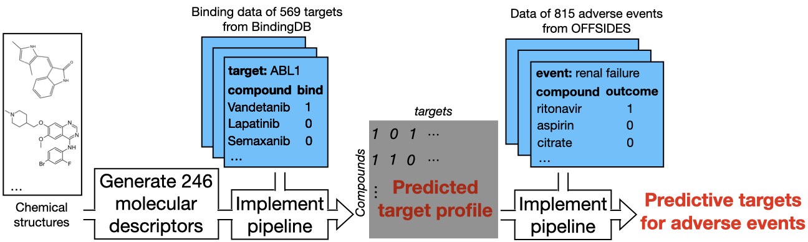
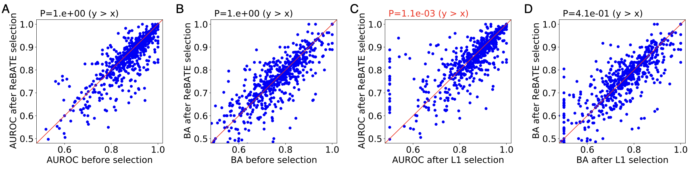
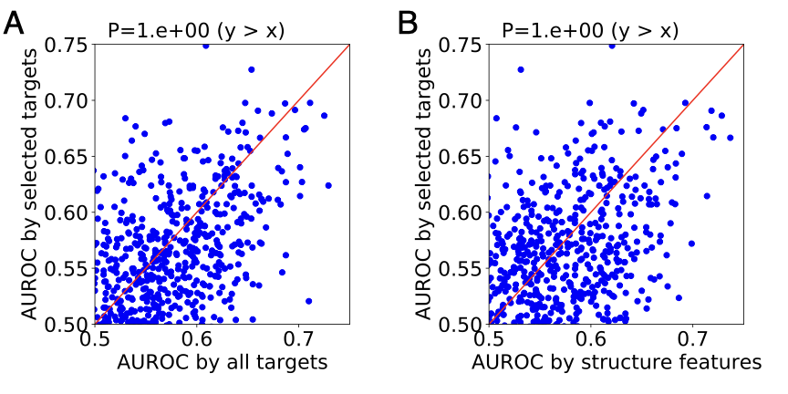

The aim of this repository is to develop a feature selection pipeline target-based prediction of drug toxicity.  

## Introduction 

A critical task of computational toxicology is to assess *in vivo* toxicity of a chemical from its structure. Currently, most researchers use Quantitative Structure-Activity Relationship (QSAR) modeling to accomplish the task. QSAR models quantify structural properties of a chemical into features, then relate the features to toxicity outcomes using supervised learning algorithms. However, QSAR models are limited by low accuracy and interpretability. They cannot identify target genes and pathways which may explain the cellular mechanisms underlying structure-toxicity associations. In this project, we aim to develop a pipeline model that connects structure to toxicity via target binding profile of chemicals. Since the feature space of structure and target are both high-dimensional, we incorporate feature selection as a key element of the pipeline. We use [ReBATE](https://github.com/EpistasisLab/ReBATE) as the feature selection method. ReBATE takes in a feature-response dataset, then ranks all the features based on differences among neighboring instances. Specifically, intragroup difference will contribute negatively to feature relevance while intergroup difference will contribute positively. MultiSURF has several advantages which makes it a proper choice for our toxicity study: (i) MultiSURF does not make assumptions regarding the population distribution, thus can be applied to both binary (e.g. chemical fingerprints) and continuous (e.g. molecular descriptors) feature sets. (ii) Unlike embedded methods such as Elastic Net, ReBATE does not depend on any induction algorithm. The identified targets can be fitted with any model for toxicity prediction. (iii) Unlike filter methods such chi-square , ReBATE evaluates the relevance of a given feature in the context of other features, thus may preserve potential target interactions. In a benchmark study, Urbanowicz et al showed that ReBATE outperforms other feature selection methods in detecting genotype-phenotype associations .

## Methods and Materials 

We developed a pipeline that can identify subset of predictive features from a feature-response dataset. A diagram of our feature selection pipeline is shown below. We start with splitting the dataset into training and validation by 4:1, and further split the training set into ten folds. We run ReBATE on data of nine fold, in order to obtain feature rank by relevance. We select top-ranked features to fit classification models recursively, until a maximal AUROC is reached on the remaining fold. We repeat the analysis for all ten folds, then identify the features that consistently appear across the optimal models. Eventually, we evaluate the performance of our feature selection pipeline on the held-out validation set. We set six hyperparameters in our pipeline, find the optimal setting via grid search. The six hyperparameters are as follows:  
+ the method used to rank features (MultiSURF; MultiSURFstar)
+ whether to implement iterative scoring (TURF) when ranking features (TURF; no TURF)
+ the method used to build classification models (RandomForest; XGBoost)
+ tolerance score: maximum AUROC-decreasing iterations before determining an optimal AUROC is reached (20; 50)
+ consistency score: proportion of optimal models in which a feature appears (0.5; 0.7)
+ target threshold (only applied for target features): threshold of validation AUROC for a target to included in the feature set (0.85; 0.9)

We implemented our pipeline on ligand binding data of 569 target proteins from BindingDB. We quantified structure properties of ligands using two available feature sets: i) 279 molecular descriptors and ii) 166 MACCS fingerprints. These sets cover most interesting chemical features for drug discovery, thus have been widely used in QSAR modeling. Detailed documentation about the dataset can be found at the [chemical repository](https://github.com/yhao-compbio/chemical). To save running time, we used the same hyperparameter setting on all targets. We tuned all settings on a subset of 100 randomly sampled targets, identified the optimal setting by median training AUROC across the 100 targets. Our pipeline returned subset of predictive descriptors for each target. We then built binding classification models upon these descriptors, applied them to obtain predicted target binding profile of 1,867 drugs. Using the profile as features, we implemented our pipeline on drug data of 815 adverse events from OFFSIDES. Detailed documentation about the dataset can be found at the [tox_data repository](https://github.com/yhao-compbio/tox_data). Our pipeline returned subset of predictive targets for each adverse event. We then built adverse event classification models upon these targets, compared the performance against structure-derived models. 

The codes to implement our pipeline can be found in [`src/`](src/), along with detailed documentation.
  
## Results 

### Our pipeline can accurately predict the binding outcomes of target proteins
We compared our binding classification models derived from selected features against two types of models: i) generic models without feature selection and ii) logistic regression models with L1 regularization. We evaluated model performance by two metrics: i) AUROC and ii) balanced accuracy (BA). We performed one-sided Wilcoxon signed-rank test for each set of comparison. The figure below shows the performance comparison for MACCS fingerprints. The P value of Wilcoxon test is shown above each scatter plot. Overall, our pipeline outperforms L1 regularization by both metrics, but does not outperform generic models without feature selection.

The figure below shows the performance comparison for molecular descriptors. Overall, our pipeline outperforms L1 regularization by both metrics, and outperforms generic models without feature selection by balanced accuracy. Of all 569 targets, 367(64.5%) have a model AUROC greater than 0.85. Since the models built upon molecular descriptors perform better than those built upon MACCS fingerprints, we focused our following analyses on the molecular descriptors. 

### Our pipeline can achieve same level of performance as QSAR models in predicting drug toxicity

We compared our adverse event classification models derived from selected targets with two types of models: i) generic models without feature selection and ii) generic models built upon molecular descriptors. We evaluated model performance by AUROC. The figure below shows the performance comparison. Overall, our pipeline does not perform better than the two types of models we compared against. 

Of all 815 adverse events, 43(5.3%) have a model AUROC greater than 0.65. We selected 13 adverse events associated with organ damage for further analysis. The table below shows the performance of our pipeline on the 13 adverse events, along with the two types of models we compared against. 

Even though our pipeline does not generate better performance in adverse event prediction, we demonstrated through [further analysis](https://github.com/yhao-compbio/target) that some selected targets can explain the cellular mechanisms underlying adverse events. 

Detailed documentation about our results and figures can be found at [`data/`](data/) and [`plot/`](plot/), respectively. 

## References

+ Urbanowicz RJ, Olson RS, Schmitt P, Meeker M, Moore JH. Benchmarking relief-based feature selection methods for bioinformatics data mining. Journal of biomedical informatics. 2018 Sep 1;85:168-88.

+ Urbanowicz RJ, Meeker M, La Cava W, Olson RS, Moore JH. Relief-based feature selection: Introduction and review. Journal of biomedical informatics. 2018 Sep 1;85:189-203.

+ Gilson MK, Liu T, Baitaluk M, Nicola G, Hwang L, Chong J. BindingDB in 2015: a public database for medicinal chemistry, computational chemistry and systems pharmacology. Nucleic acids research. 2016 Jan 4;44(D1):D1045-53.

+ Tatonetti NP, Patrick PY, Daneshjou R, Altman RB. Data-driven prediction of drug effects and interactions. Science translational medicine. 2012 Mar 14;4(125):125ra31-.

